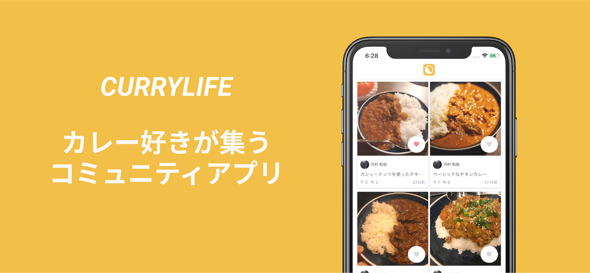

# CURRYLIFE

CURRYLIFE（カリーライフ）is a community application for curry lovers.

Currently available for both android and iOS.

## Installation

## Technologies

### App (Android and iOS)
- Typescript
- React Native

### API
- Typescript / Node.js
- micro
- GraphQL
- Clean Architecture
- Firebase (Firestore, Authentication, Functions, Storage)
- Deployed using Heroku

### Web
- Typescript
- React
- Next.js
- tailwind
- Deployed using Now
